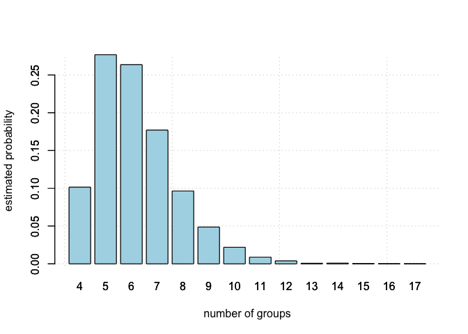
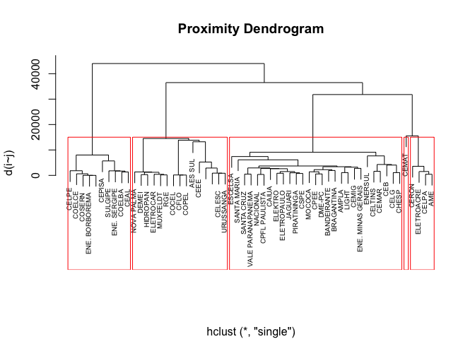
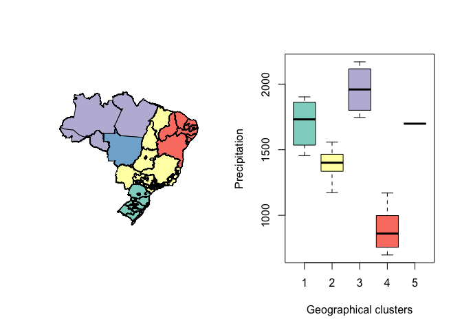

gbdcd
=====

[](https://travis-ci.org/leandromineti/gbdcd) [](https://ci.appveyor.com/project/leandromineti/gbdcd) [](https://codecov.io/gh/leandromineti/gbdcd) [](https://zenodo.org/badge/latestdoi/102520939)

Overview
--------

An R package implementing the Bayesian Detection of Clusters and Discontinuities.

Installation
------------

``` r
library(devtools)

devtools::install_github("leandromineti/gbdcd")
```

If you are a Windows user, make sure you have [Rtools](https://cran.r-project.org/bin/windows/Rtools/) installed.

Usage
-----

``` r
library(gbdcd)

data("aneeldata", package = "gbdcd")
data("aneelshape", package = "gbdcd")

target_variable <- aneelshape$z_Precipitation
neighbors <- aneeldata$connections

out <- gaussianBDCD(y = target_variable, 
                    neigh = neighbors, 
                    c = 0.35, 
                    n_iterations = 100000, 
                    burn_in = 50000, 
                    mu0 = 0, 
                    sigma0 = sqrt(2))
```

Results
-------

From the results obtained in the previous function we can look at many variables like: posterior distribution, proximity dendogram and the map regionalization.

### Posterior distribution

``` r
barplot(table(out$k.MCMC)/sum(table(out$k.MCMC)), col="light blue",
        xlab="number of groups", ylab="estimated probability")
grid()
barplot(table(out$k.MCMC)/sum(table(out$k.MCMC)), add=T, col="light blue")
```



### Proximity dendogram

``` r
n_cluster <- as.numeric(names(which.max(table(out$k.MCMC))))

plot(out$cluster.info, ylab="d(i~j)", main="Proximity Dendrogram", xlab="", 
     labels=aneelshape$DMU, cex=0.6)

groups <- cutree(out$cluster.info, k = n_cluster)
rect.hclust(out$cluster.info, k=n_cluster, border="red")
```



### Map regionalization

``` r
library(RColorBrewer)
library(spdep)

colrs <- brewer.pal(n_cluster, "Set3")

par(mfrow = c(1,2))
plot(aneelshape, col=colrs[groups])
boxplot(aneelshape$z_Precipitation ~ groups, col=colrs,
        ylab="Precipitation", xlab="Geographical clusters")
```



### Todo list

-   \[x\] basic unit testing for all functions.
-   \[x\] turn all variable and function names into English.
-   \[x\] improve README with results.
-   \[x\] improve function documentation.
-   \[ \] publish package on CRAN.
